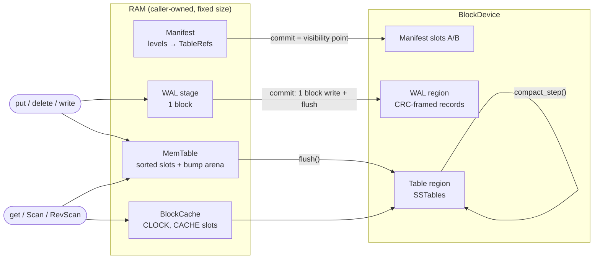

# horton

A log-structured merge-tree key-value store for places where `malloc`
doesn't exist: firmware, kernels, bootloaders.

- **`#![no_std]`, no `alloc`, zero dependencies.** The `[dependencies]` table
  is empty; the crate uses nothing but `core`.
- **`#![forbid(unsafe_code)]`.** The ESP32-S3 flash driver's register logic
  is safe too. The volatile MMIO half lives in the board crate.
- **Every byte is caller-owned and sized at compile time.** The database, a
  scan, and the compaction scratch are fixed-size values sized by const
  generics. Put them in `static`s and you know your RAM bill before you
  flash the board.
- **No panics in library code.** Every failure is an [`Error`](src/error.rs)
  variant, including `BufferTooSmall { need }` instead of silent truncation.
- **Async from the bottom.** The only I/O boundary is a poll-based
  [`BlockDevice`](src/device.rs) trait. The API is `async fn`s that allocate
  nothing, and horton ships no executor: use embassy, RTIC, or a poll loop.

> **Status: pre-1.0 (v0.16), experimental.** The on-disk format changes
> between minor versions, and old images are rejected rather than misread.
> Read [the architecture review](docs/ARCHITECTURE_REVIEW.md) before relying
> on it. It lists confirmed correctness and capacity issues that are not
> yet fixed.

## Features

| Area | What you get |
|---|---|
| Writes | `put`, `delete`, `delete_range` (range tombstones), `put_with_ttl` (caller-clock expiry), atomic multi-op `WriteBatch` (up to one WAL block) |
| Reads | `get`, snapshot reads (`snapshot` / `get_at`), forward `Scan` and reverse `RevScan` merge iterators with prefix/range bounds |
| Durability | WAL-first. Every mutation's CRC-framed record is on the device before the call returns. A double-buffered manifest is the single atomic commit point for flushes, compactions and archive operations |
| Tables | Immutable SSTables with restart-point data blocks, a per-table bloom filter, one index block, a range-tombstone section, and optional hand-rolled LZ77 block compression |
| Compaction | Leveled and caller-driven: `compact_step` seals at most one output block per call, so firmware can interleave it with real-time work. Snapshot-aware version retention and tombstone dropping |
| Caching | Optional fixed-slot CLOCK block cache inside `Db` (`CACHE = 0` turns it off) |
| Cold storage | Archive API: seal a table, stream its blocks to your own remote sink, then forget it locally (`archive_plan` / `archive_commit`). `ingest_table` re-attaches it later. The archive commit refuses any removal that would bring deleted data back |
| Hardware | `FlashBlockDevice` (erase-aware NOR adapter) and an ESP32-S3 SPI1 flash driver over a pluggable register bus |

## Quick start

horton has no dependencies and is not on crates.io yet. Use a path or git
dependency:

```toml
[dependencies]
horton = { git = "https://github.com/madmax983/horton" }
```

Implement `BlockDevice` for your storage, choose the sizes, and drive the
futures with your executor. Condensed from
[`examples/quickstart.rs`](examples/quickstart.rs), which is complete and
runs with `cargo run --example quickstart`:

```rust
use horton::{BlockDevice, Compaction, Config, Db, Progress, Scan};

//              device   BLOCK KEY VAL CAP ARENA LEVELS TABLES BLOOM CACHE
type MyDb = Db<RamDisk, 4096,  64, 256, 64, 8192, 4,     4,     256, 4>;

// Block-id layout: manifest slots 0 and 1, WAL [2, 66), tables [66, 512).
let config = Config::new(2, 66, 66, 512, 0, 1);
let mut db = MyDb::new(RamDisk::new(512), config); // `const fn`: fine in a `static`
db.open().await?; // recover manifest, rebuild table slots, replay WAL

db.put(b"sensor/001", b"21.5C").await?; // durable when this returns
db.delete(b"sensor/002").await?;

let mut val = [0u8; 256];
if let Some(n) = db.get(b"sensor/001", &mut val).await? {
    // &val[..n] == b"21.5C"
}

db.flush().await?; // memtable -> immutable SSTable (atomic manifest commit)

let mut scan = Scan::new(&db); // borrows `db`: no writes while it lives
scan.seek(b"sensor/", Some(b"sensor0"), u64::MAX).await?;
let mut key = [0u8; 64];
while let Some((kl, vl)) = scan.next(&mut key, &mut val).await? {
    // (&key[..kl], &val[..vl])
}

let mut scratch = Compaction::<4096, 64, 256, 256>::new(); // caller-owned
while db.compaction_pending() {
    while db.compact_step(&mut scratch).await? == Progress::More {}
}
```

Capacity errors tell you to make room. `TableFull` or `ArenaFull` from a
write means *flush*. `NoSpace` from `flush` usually means *compact first*
(level 0 is full), and from a write it can mean the WAL region is exhausted,
in which case *flush*. See the review for why `NoSpace` covers too much.

## Architecture



**Write path.** A mutation is encoded into the WAL stage block, written and
flushed to the device, and only then inserted into the memtable. A torn WAL
tail is the expected crash boundary, and recovery replays up to it.

**Flush.** The memtable is streamed into a new SSTable in a free *table
slot*. The table region is split into `LEVELS × TABLES` equal slots, one
table per slot, so the manifest's table capacity and the region's space
are one budget and a table can never grow into its neighbour. The slot is
claimed only when the manifest commit lands, so a failed or interrupted
flush changes nothing.

**Read path.** Reads check the memtable, then level 0 newest-first, then
deeper levels. Tables are pruned by key range and max sequence and gated by
the bloom filter. The highest sequence number wins, and range tombstones
and TTL expiry are applied afterwards.

**Compaction.** When a level holds `TABLES` tables, the deepest full level
is compacted into the next one. The input is all of L0, or the oldest table
of a deeper level, plus the overlapping target tables. It is a linear-scan
k-way merge (at most 8 inputs) that keeps the newest version of each key
plus the newest version visible to each live snapshot.

**Crash model.** The manifest is double-buffered in two fixed slots, and
recovery takes the valid slot with the higher sequence number. Every
structural change (flush, compaction, archive, ingest, WAL wrap) becomes
visible in exactly one manifest write. Blocks written before that point sit
in a slot no manifest table references, which is simply free again after
`open()` rebuilds the slot map from the manifest.

### On-device layout

```text
block ids:  [manifest A] [manifest B] ... [ WAL region ) ... [ table region )
                 └ Config::manifest_a/b     └ wal_start..wal_end   └ tbl_start..tbl_end

SSTable:    [rdel]* [data]* [bloom] [index] [footer]
             │       │        │       │       └ magic "lsmtable", ids, entry count, k, rdel count
             │       │        │       └ per data block: first key, block id, max seq
             │       │        └ BLOOM_BYTES bit array
             │       └ entries + restart points; optionally LZ77-compressed (flag bit in trailer)
             └ range tombstones sorted by (start asc, seq desc)
every block ends in a CRC32 of its payload
```

The full format and protocol spec is [`SPEC.md`](SPEC.md) §4. Its §9 is the
per-version design log.

## Sizing

Everything is a const generic on `Db`:

| Param | Meaning |
|---|---|
| `BLOCK` | Device block size in bytes. Must equal `D::BLOCK`, and must be at least 512 and fit the largest WAL record |
| `KEY_MAX`, `VAL_MAX` | Maximum key and value lengths |
| `CAP`, `ARENA` | Memtable slots (versions) and key/value arena bytes |
| `LEVELS`, `TABLES` | Level count and tables per level. `LEVELS × TABLES` (at most 64) is also the number of table slots the region is split into; each slot must hold a full memtable's table, which `open()` checks |
| `BLOOM_BYTES` | Bloom filter size per table (bits = 8 × bytes) |
| `CACHE` | Block cache slots. `0` disables the cache |

`horton::profile` has a measured ESP32-S3 instantiation (4 KiB blocks,
32-byte keys, 64-byte values, 16-entry memtable, 4 × 4 levels, 2-slot
cache): `Db` 25,576 + `Scan` 10,536 + `Compaction` 56,408 = 92,520 bytes
of static RAM, asserted under a 96 KiB budget by `tests/profile.rs`. See
[`BUDGET.md`](BUDGET.md). The async futures themselves are not in that
budget yet. `flush()`'s future is about 25 KiB on that profile.

## Platforms

- **Host (x86_64 / macOS / Linux):** where the test suite runs. `std`
  appears only in tests, benches, and examples.
- **ESP32-S3 (`xtensa-esp32s3-none-elf`):** the library builds with the ESP
  Rust fork (`./xtensa-check.sh`). A bare-metal smoke binary
  (`xtensa-smoke/`) boots under QEMU and exercises
  put/get/delete/flush/compact/scan/snapshot. `src/esp32s3.rs` follows
  ESP-IDF v5.2's register sequences and is verified against a mock NOR chip.
  **It has not been verified on silicon yet** (timing, power loss), because
  QEMU does not emulate the SPI user-command path.

## Testing

```sh
cargo test                        # ~300 tests: unit, integration, crash injection, fuzz
cargo test --release              # same suite, optimized
cargo run --example quickstart
cargo +nightly miri test --test <name>          # UB check (the crate has no unsafe)
cargo build --release --benches                 # callgrind instruction-count harnesses
./xtensa-check.sh                               # ESP32-S3 build gate (needs the esp toolchain)
```

What the suite covers:

- **Crash injection.** Every block write is enumerated as a crash point over
  flush, compaction, TTL purge, batches, archive and ingest. The recovered
  state must be exactly the pre-commit or post-commit state. A torn-write
  variant models partially written blocks.
- **Differential and property tests** against a `BTreeMap` oracle and the
  executable models in `src/model.rs` (visibility, the per-key keep-set,
  TTL and range-delete winners).
- **In-tree, dependency-free fuzzers** for the WAL, SSTable, manifest and
  LZ77 decoders. Bit flips, truncations and splices must produce clean
  `Error`s and never a panic.
- **Mutation testing** with `cargo-mutants` on the core modules. See
  [`MUTATION_TRIAGE.md`](MUTATION_TRIAGE.md).

## Repository layout

| Path | Contents |
|---|---|
| `src/db.rs` | `Db`: open/recovery, write path, point reads, flush, compaction selection and commit, archive and ingest |
| `src/wal.rs` | WAL record codec, writer, recovery |
| `src/memtable.rs` | Sorted-slot memtable over a bump arena |
| `src/sstable.rs` | SSTable writer and reader, bloom filter, index, range-tombstone blocks, relocation |
| `src/compact.rs` | Merge engine, cursors, range-tombstone merger |
| `src/scan.rs` | `Scan` / `RevScan` merge iterators |
| `src/manifest.rs` | Manifest encoding and double-buffered commit/recover |
| `src/alloc.rs` | Table-slot allocator: one table per fixed slot, next-fit, reservations |
| `src/cache.rs` | CLOCK block cache |
| `src/compress.rs` | LZ77 block codec |
| `src/batch.rs` | `WriteBatch` |
| `src/crc.rs` | Slicing-by-8 CRC-32 |
| `src/model.rs` | Executable models used as test oracles |
| `src/device.rs`, `src/flash.rs`, `src/esp32s3.rs` | `BlockDevice` trait, NOR flash adapter, ESP32-S3 SPI flash driver |
| `src/profile.rs` | Measured ESP32-S3 const-generic profile |
| `tests/` | Integration, crash, fuzz, differential, and mutation-killing tests |
| `benches/` | `harness = false` callgrind/cachegrind harnesses |
| `xtensa-smoke/` | Bare-metal ESP32-S3 QEMU smoke test |

## Documents

- [`SPEC.md`](SPEC.md): design spec, on-disk formats, and the per-version design log.
- [`docs/ARCHITECTURE_REVIEW.md`](docs/ARCHITECTURE_REVIEW.md): architecture
  review (2026-09) with confirmed issues and recommendations.
- [`BUDGET.md`](BUDGET.md): ESP32-S3 RAM accounting.
- [`MUTATION_TRIAGE.md`](MUTATION_TRIAGE.md): mutation-testing results and
  equivalent-mutant reasoning.

## License

Dual-licensed under MIT OR Apache-2.0, as declared in `Cargo.toml`.
