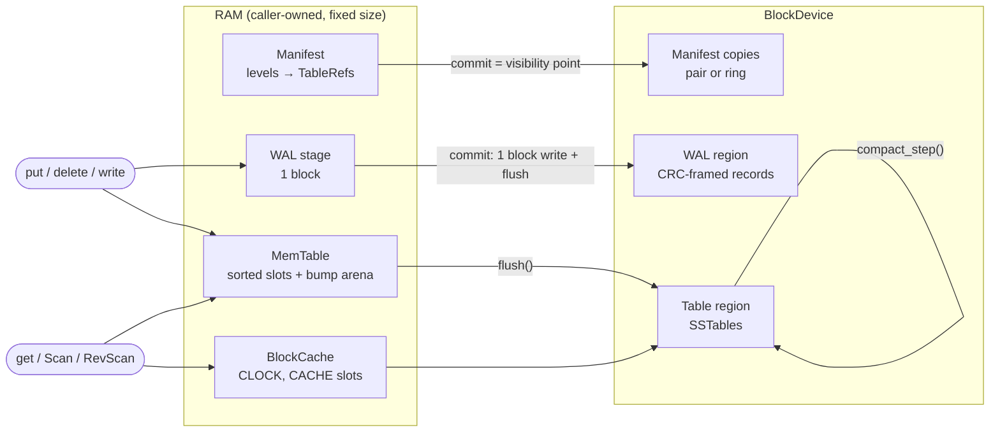

# horton

A log-structured merge-tree key-value store for places where `malloc`
doesn't exist: firmware, kernels, bootloaders.

- **`#![no_std]`, no `alloc`, zero dependencies.** The `[dependencies]` table
  is empty; the crate uses nothing but `core`.
- **`#![forbid(unsafe_code)]`.** The ESP32-S3 flash driver's register logic
  is safe too. The volatile MMIO half lives in the board crate.
- **Every byte is caller-owned and sized at compile time.** The database, a
  scan, and the compaction scratch are fixed-size values sized by const
  generics. Put them in `static`s and you know your RAM bill before you
  flash the board.
- **No panics in library code.** Every failure is an [`Error`](src/error.rs)
  variant, including `BufferTooSmall { need }` instead of silent truncation.
- **Async from the bottom.** The only I/O boundary is a poll-based
  [`BlockDevice`](src/device.rs) trait. The API is `async fn`s that allocate
  nothing, and horton ships no executor: use embassy, RTIC, or a poll loop.

> **Status: pre-1.0 (v0.17), experimental.** The on-disk format changes
> between minor versions, and old images are rejected rather than misread.
> v0.17 fixes every finding of [the architecture review](docs/ARCHITECTURE_REVIEW.md)
> (each has a regression test in `tests/review_findings.rs`). It is not yet
> verified on ESP32-S3 silicon.

## Features

| Area | What you get |
|---|---|
| Writes | `put`, `delete`, `delete_range` (range tombstones), `put_with_ttl` (caller-clock expiry), atomic multi-op `WriteBatch` (up to one WAL block; also the group-commit path) |
| Reads | `get`, snapshot reads (`snapshot` / `get_at`), forward `Scan` and reverse `RevScan` merge iterators with prefix/range bounds |
| Durability | WAL-first. Every mutation's CRC-framed record is on the device before the call returns. The manifest (two copies, or a ring of `n` for flash endurance) is the single atomic commit point for flushes, compactions and archive operations |
| Tables | Immutable SSTables with restart-point data blocks, a per-table bloom filter, one index block, a range-tombstone section, and optional hand-rolled LZ77 block compression |
| Compaction | Leveled and caller-driven: `compact_step` does bounded work per call, so firmware can interleave it with real-time work. Outputs split at slot size and commit one by one; trivial moves, small-table consolidation, and region-pressure push-down keep the region usable until it is mostly full. Snapshot-aware version retention; point and range deletes give their space back |
| Caching | Optional fixed-slot CLOCK block cache inside `Db` (`CACHE = 0` turns it off) |
| Cold storage | Archive API: seal a table, stream its blocks to your own remote sink, then forget it locally (`archive_plan` / `archive_commit`). `ingest_table` re-attaches it later. The archive commit refuses any removal that would bring deleted data back |
| Hardware | `FlashBlockDevice` (erase-aware NOR adapter) and an ESP32-S3 SPI1 flash driver over a pluggable register bus |

## Quick start

horton has no dependencies and is not on crates.io yet. Use a path or git
dependency:

```toml
[dependencies]
horton = { git = "https://github.com/madmax983/horton" }
```

Implement `BlockDevice` for your storage, choose the sizes, and drive the
futures with your executor. Condensed from
[`examples/quickstart.rs`](examples/quickstart.rs), which is complete and
runs with `cargo run --example quickstart`:

```rust
use horton::{BlockDevice, Config, Progress, Scan};

// Every size is a named const generic; `MyDb<D>` works over any device.
horton::db_types! {
    block: 4096,           // device block size
    key_max: 64,           // longest key
    val_max: 256,          // longest value
    memtable_entries: 64,  // memtable slots
    memtable_arena: 8192,  // memtable key+value bytes
    levels: 4,
    tables_per_level: 4,
    bloom_bytes: 256,      // per-table bloom filter
    cache_blocks: 4;       // block cache (0 = off)
    type Db = MyDb;
    type Compaction = MyCompaction;
}

// Block-id layout: manifest slots 0 and 1, WAL [2, 66), tables [66, 512).
let config = Config::new(2, 66, 66, 512, 0, 1);
let mut db = MyDb::new(RamDisk::new(512), config); // `const fn`: fine in a `static`
db.open().await?; // recover manifest, rebuild table slots, replay WAL

db.put(b"sensor/001", b"21.5C").await?; // durable when this returns
db.delete(b"sensor/002").await?;

let mut val = [0u8; 256];
if let Some(n) = db.get(b"sensor/001", &mut val).await? {
    // &val[..n] == b"21.5C"
}

db.flush().await?; // memtable -> immutable SSTable (atomic manifest commit)

let mut scan = Scan::new(&db); // borrows `db`: no writes while it lives
scan.seek(b"sensor/", Some(b"sensor0"), u64::MAX).await?;
let mut key = [0u8; 64];
while let Some((kl, vl)) = scan.next(&mut key, &mut val).await? {
    // (&key[..kl], &val[..vl])
}

let mut scratch = MyCompaction::new(); // caller-owned
while db.compaction_pending() {
    while db.compact_step(&mut scratch).await? == Progress::More {}
}
```

Capacity errors name their remedy:

| Error | Meaning | Do this |
|---|---|---|
| `TableFull`, `ArenaFull` | the memtable is full | `flush()`, retry |
| `WalFull` | the WAL region is exhausted | `flush()` (it wraps the WAL), retry |
| `NeedsCompaction` | level 0 is full, or no slot is free until tables merge | `compact_step` until `Done`, retry |
| `RegionFull` | no slot is free and compaction cannot free one | delete and compact, archive, or grow the region |
| `SnapshotLimit` | eight snapshots are live | release one |
| `TableTooLarge` | an entry, index, or range-tombstone section does not fit | smaller entries, bigger blocks or slots |
| `BatchTooLarge` | a batch does not fit one WAL block | split it |
| `Busy` | another `get` on this handle holds the read buffers | finish it, retry |
| `BadConfig` | regions overlap or are too small (from `open`) | fix the `Config` |

`NeedsCompaction` is only returned while `compaction_pending()` is true, so
a compact-then-retry loop always makes progress.

## Architecture



**Write path.** A mutation is encoded into the WAL stage block, written and
flushed to the device, and only then inserted into the memtable. A torn WAL
tail is the expected crash boundary, and recovery replays up to it.

**Flush.** The memtable is streamed into a new SSTable in a free *table
slot*. The table region is split into `LEVELS × TABLES` equal slots, one
table per slot, so the manifest's table capacity and the region's space
are one budget and a table can never grow into its neighbour. The slot is
claimed only when the manifest commit lands, so a failed or interrupted
flush changes nothing.

**Read path.** Reads check the memtable, then level 0 newest-first, then
deeper levels. Tables are pruned by key range and max sequence and gated by
the bloom filter. The highest sequence number wins, and range tombstones
and TTL expiry are applied afterwards.

**Compaction.** Full levels compact first, deepest first; when the region
runs short, pressure pushes tables down too. A job merges L0 (or its oldest
tables), or one table of a deeper level, with the overlapping tables below
in a linear-scan k-way merge (at most 8 cursors) that keeps the newest
version of each key plus the newest version visible to each live snapshot.
Outputs split at slot size and commit one at a time: inputs the output has
passed retire, the one it is inside is narrowed past it. Tombstones — point
and range — are dropped once no reader can see what they hide
([ADR-0010](docs/adr/0010-split-output-compaction.md)).

**Crash model.** The manifest is stored as whole copies (a pair, or a ring
of `n`), each spanning as many blocks as the worst case needs; every block
carries the commit's sequence number and CRC, and recovery takes the
newest copy whose blocks all agree. Every structural change (flush,
compaction output, archive, ingest, WAL wrap) becomes visible in exactly
one manifest commit. Blocks written before that point sit in a slot no
manifest table references, which is simply free again after `open()`
rebuilds the slot map from the manifest.

### On-device layout

```text
block ids:  [manifest copy]×2..n ... [ WAL region ) ... [ table region: LEVELS×TABLES slots )
             └ each Manifest::max_blocks  └ wal_start..wal_end   └ tbl_start..tbl_end
               blocks, magic "hrtman05"

SSTable:    [data]* [rdel]* [bloom] [index] [footer]
             │       │        │       │       └ magic "hrtsst02", ids, entry count, k, rdel count, min seq
             │       │        │       └ per data block: first key, block id, max seq
             │       │        └ BLOOM_BYTES bit array
             │       └ range tombstones sorted by start
             └ entries + restart points; optionally LZ77-compressed (flag bit in trailer)
every block ends in a CRC32 of its payload
```

The full format and protocol spec is [`SPEC.md`](SPEC.md) §4.

## Sizing

Everything is a const generic on `Db`:

| Param | Meaning |
|---|---|
| `BLOCK` | Device block size in bytes. Must equal `D::BLOCK`, and must be at least 512 and fit the largest WAL record |
| `KEY_MAX`, `VAL_MAX` | Maximum key and value lengths |
| `CAP`, `ARENA` | Memtable slots (versions) and key/value arena bytes |
| `LEVELS`, `TABLES` | Level count and tables per level. `LEVELS × TABLES` (at most 64) is also the number of table slots the region is split into; each slot must hold a full memtable's table, which `open()` checks |
| `BLOOM_BYTES` | Bloom filter size per table (bits = 8 × bytes) |
| `CACHE` | Block cache slots. `0` disables the cache |

Declare a shape with `horton::db_types!` (named parameters, as in the
quick start) rather than spelling ten positional const generics.

`horton::profile` has a measured ESP32-S3 instantiation (4 KiB blocks,
32-byte keys, 64-byte values, 16-entry memtable, 4 × 4 levels, 2-slot
cache): `Db` 25,248 + `Scan` 10,536 + `Compaction` 58,840 = 94,624 bytes
of structs, plus at most 17.6 KiB of live futures (`flush()`), for a
measured peak of 112,200 bytes under a 112 KiB budget asserted by
`tests/profile.rs`. See [`BUDGET.md`](BUDGET.md).

Region sizing (checked by `open()`, `BadConfig` otherwise):

- **Manifest:** each copy is `Manifest::max_blocks::<BLOCK>()` blocks, the
  worst case for `LEVELS × TABLES` tables with `KEY_MAX` bounds (1 block
  for the ESP32 profile, 4 for 256-byte keys × 28 tables).
- **Tables:** the region splits into `LEVELS × TABLES` equal slots, and a
  slot must hold a full memtable's table. A table never outgrows its slot,
  so the region holds `LEVELS × TABLES × slot_blocks` blocks of tables.
- **WAL:** one block per durable commit between flushes.

### Flash endurance

On NOR flash every block write is a sector erase. Batch writes that arrive
together into one `WriteBatch` (one erase instead of one per op), and use
`Config::with_manifest_ring(n)` to spread manifest erases over `n` copies.
Table slots are allocated next-fit, so table erases spread across the
region. See [ADR-0012](docs/adr/0012-nor-flash-endurance.md).

## Platforms

- **Host (x86_64 / macOS / Linux):** where the test suite runs. `std`
  appears only in tests, benches, and examples.
- **ESP32-S3 (`xtensa-esp32s3-none-elf`):** the library builds with the ESP
  Rust fork (`./xtensa-check.sh`). A bare-metal smoke binary
  (`xtensa-smoke/`) boots under QEMU and exercises
  put/get/delete/flush/compact/scan/snapshot. `src/esp32s3.rs` follows
  ESP-IDF v5.2's register sequences and is verified against a mock NOR chip.
  **It has not been verified on silicon yet** (timing, power loss), because
  QEMU does not emulate the SPI user-command path.

## Testing

```sh
cargo test                        # ~350 tests: unit, integration, crash injection, fuzz
LIFECYCLE_SEEDS=300 cargo test --release --test lifecycle   # wider fuzz sweep
cargo test --release              # same suite, optimized
cargo run --example quickstart
cargo +nightly miri test --test <name>          # UB check (the crate has no unsafe)
cargo build --release --benches                 # callgrind instruction-count harnesses
./xtensa-check.sh                               # ESP32-S3 build gate (needs the esp toolchain)
```

What the suite covers:

- **Crash injection.** Every block write is enumerated as a crash point over
  flush, compaction (multi-output jobs included), TTL purge, batches,
  archive and ingest. The recovered state must be one of the committed
  states. A torn-write variant models partially written blocks, including
  torn multi-block manifest commits.
- **Lifecycle fuzzer** (`tests/lifecycle.rs`): long random operation
  sequences with reopen, WAL wrap, archive and re-ingest on small regions,
  checking `Db::check_invariants` after every op against a `BTreeMap`
  oracle.
- **Review regressions** (`tests/review_findings.rs`): one test per
  architecture-review finding; CI fails if one is ignored.
- **Differential and property tests** against a `BTreeMap` oracle and the
  executable models in `src/model.rs` (visibility, the per-key keep-set,
  TTL and range-delete winners).
- **In-tree, dependency-free fuzzers** for the WAL, SSTable, manifest and
  LZ77 decoders. Bit flips, truncations and splices must produce clean
  `Error`s and never a panic.
- **Mutation testing** with `cargo-mutants` on the core modules. See
  [`MUTATION_TRIAGE.md`](MUTATION_TRIAGE.md).

## Repository layout

| Path | Contents |
|---|---|
| `src/db/` | `Db`: `mod.rs` (config, open/recovery, write path), `read.rs`, `flush.rs`, `compaction.rs` (job policy and commits), `archive.rs` (archive and ingest), `invariants.rs` |
| `src/wal.rs` | WAL record codec, writer, recovery |
| `src/memtable.rs` | Sorted-slot memtable over a bump arena |
| `src/sstable.rs` | SSTable writer and reader, bloom filter, index, range-tombstone blocks, relocation |
| `src/compact.rs` | Merge engine, cursors, range-tombstone merger |
| `src/scan.rs` | `Scan` / `RevScan` merge iterators |
| `src/manifest.rs` | Manifest: multi-block copies, pair or ring layout, staged edits, commit/recover |
| `src/slots.rs` | Table-slot allocator: one table per fixed slot, next-fit, reservations |
| `src/cache.rs` | CLOCK block cache |
| `src/compress.rs` | LZ77 block codec |
| `src/batch.rs` | `WriteBatch` |
| `src/crc.rs` | Slicing-by-8 CRC-32 |
| `src/model.rs` | Executable models used as test oracles |
| `src/device.rs`, `src/flash.rs`, `src/esp32s3.rs` | `BlockDevice` trait, NOR flash adapter, ESP32-S3 SPI flash driver |
| `src/profile.rs`, `src/macros.rs` | Measured ESP32-S3 profile; the `db_types!` macro |
| `tests/` | Integration, crash, fuzz, differential, and mutation-killing tests |
| `benches/` | `harness = false` callgrind/cachegrind harnesses |
| `xtensa-smoke/` | Bare-metal ESP32-S3 QEMU smoke test |

## Documents

- [`SPEC.md`](SPEC.md): normative spec: constraints, formats, protocols, API.
- [`CHANGELOG.md`](CHANGELOG.md): what changed in each version.
- [`docs/adr/`](docs/adr/README.md): architecture decision records.
- [`docs/ARCHITECTURE_REVIEW.md`](docs/ARCHITECTURE_REVIEW.md): the v0.16
  architecture review and the status of each finding.
- [`docs/history/`](docs/history/milestones-v0.1-v0.16.md): the v0.1–v0.16
  milestone log with its test-run reports.
- [`BUDGET.md`](BUDGET.md): ESP32-S3 RAM accounting.
- [`MUTATION_TRIAGE.md`](MUTATION_TRIAGE.md): mutation-testing results and
  equivalent-mutant reasoning.

## License

Dual-licensed under MIT OR Apache-2.0, as declared in `Cargo.toml`.
