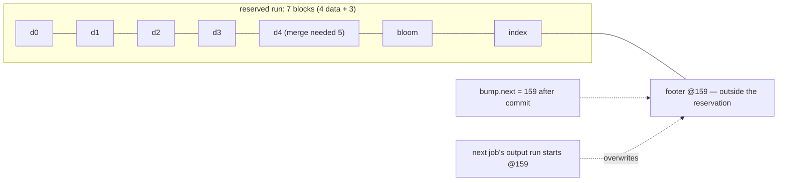
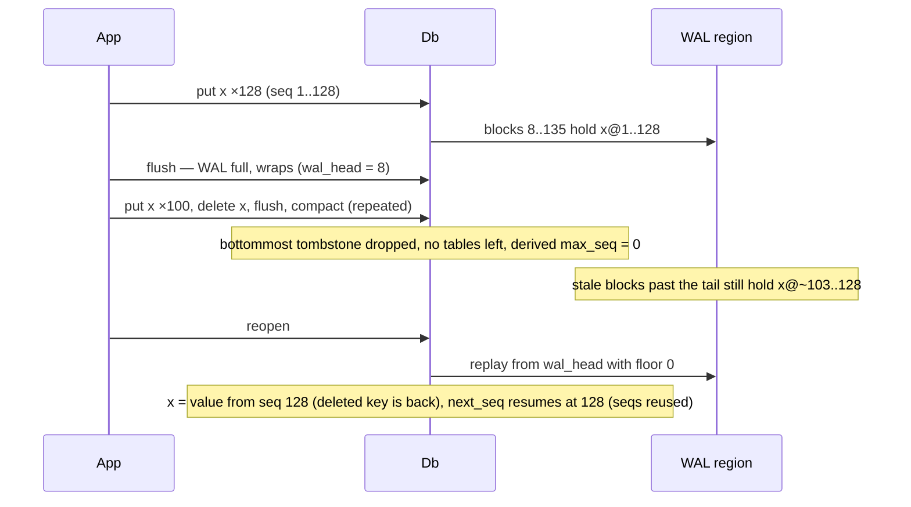
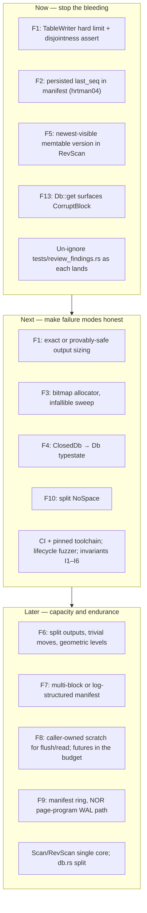

# Architecture review — horton v0.16.0

- **Date:** 2026-09-24
- **Revision:** `3acd049` (main)
- **Scope:** the whole library (`src/`), the spec and budget documents, the
  test and verification strategy, and repository hygiene.
- **Method:** I read `SPEC.md`, then `db.rs`, `wal.rs`, `alloc.rs`,
  `manifest.rs`, `flash.rs` and `profile.rs` in full, and the writer and
  merge halves of `sstable.rs` and `compact.rs`. I skimmed `memtable.rs`,
  `cache.rs` and `batch.rs`; `esp32s3.rs`, `crc.rs` and `model.rs` were not
  reviewed in depth. A delegated sub-review covered `scan.rs` and
  `compress.rs`, and I re-checked its load-bearing claims. I ran the full suite (≈300 tests,
  all green on rustc 1.97.0), then probed suspected defects with small
  programs against the public API. Every defect marked **confirmed** has a
  failing test in [`tests/review_findings.rs`](../tests/review_findings.rs).
  Those tests are `#[ignore]`d, so `cargo test` stays green, and they fail
  under `cargo test --test review_findings -- --ignored`.

## Verdict

horton's core design holds up and is unusually disciplined:

- one atomic visibility point (the manifest commit) for every structural
  change;
- *reserve, write, commit, then claim* allocation;
- caller-owned, const-sized memory;
- a poll-based I/O trait that keeps the crate `core`-only;
- an exhaustive crash injector around all of it.

The crash-atomicity story is the strongest part of the codebase, and
nothing below undermines it.

The defects are in two places the test suite does not state as invariants:

1. **Resource accounting.** Which blocks a table owns, how many free
   blocks can be tracked, and how big the manifest can get.
2. **Cross-lifecycle invariants.** What must stay true across compaction,
   WAL wrap and reopen, such as "sequence numbers never go backwards".

Most defects below violate a property that nobody wrote down, so no test
checks it. Two of them silently destroy or resurrect data. A third
structural limit makes the database stop accepting writes at a few percent
of its configured capacity, and the headline workload (append-only
time-series keys) is the worst case.

| # | Finding | Severity | Status |
|---|---|---|---|
| F1 | Compaction output can outgrow its reserved run and overwrite a live table | **Critical**: silent data loss | Confirmed |
| F2 | WAL replay floor and sequence counter are derived, not persisted, so stale records resurrect, `open()` fails, and sequence numbers are reused | **Critical**: resurrection, bricked open | Confirmed |
| F3 | An undersized `FREELIST` makes `open()` fail after ordinary compaction | High: device won't open | Confirmed |
| F4 | `Db` accepts writes before `open()` and overwrites live WAL blocks | High: acknowledged data lost (misuse) | Confirmed |
| F5 | `RevScan` yields the *oldest* memtable version, so deleted keys reappear | High: wrong results | Confirmed |
| F6 | Compaction never splits its output, so the DB stops accepting writes at ~4% of the region | High: capacity / liveness | Measured |
| F13 | A corrupt data block makes `get` silently return an *older* value, while `Scan` returns `CorruptBlock` | High: silent stale reads | Confirmed (design decision to revisit) |
| F7 | Manifest size is not bounded at compile time. `TestDb` stops at 7 of 28 table slots | Medium | Confirmed |
| F8 | The RAM budget leaves out async futures: `flush()` is 25.7 KiB on the ESP32 profile | Medium | Measured |
| F9 | NOR-flash write amplification and wear: one sector erase per mutation, 2-sector manifest | Medium | Analysis |
| F10 | `Error::NoSpace` covers about ten distinct conditions with different remedies | Medium | Confirmed |
| F11 | Const-generic configuration: missing validity asserts, error-prone positional parameters | Low–Medium | Confirmed |
| F12 | A sequence-0 entry (reachable via `ingest_table`) wedges `Scan::next` | Low | Reported by the scan sub-review |

---

## Critical

### F1 — Compaction output can outgrow its reservation and overwrite a live table

**Where.** `compact_select` reserves `total_data + rdel + 3` blocks
(`src/db.rs:1951-1970`). The comment explains why: *"the data merge only
shrinks the inputs (dedup plus tombstone drops), so their data blocks
always suffice."* `compact_commit` then advances the bump pointer by the
**reservation** (`src/db.rs:2169`), not by the blocks the table actually
used. `TableWriter` stores only `base` and never checks writes against a
limit, even though its docs at `src/sstable.rs:498`, `:614` and `:727`
promise `NoSpace` "when the table outgrows its pre-allocated run".

**Why the premise is false.** Data blocks are filled greedily in key order
(next-fit bin packing), and next-fit is not sub-additive under
interleaving. Take four L0 tables that each pack three 1,041-byte entries
and one 965-byte entry into exactly one block (4,088 bytes of payload).
Merged, the twelve large entries come first, and the result is five blocks
against a reservation of four. The SPEC already makes this argument for the
range-tombstone section ("a sorted cross-input merge is not a subsequence
of the concatenation") and handles it with a dry-run count. The data
section needs the same care.

**What happens.** `tests/review_findings.rs::f1_…` runs four flushes, one
compaction, four more flushes and a second compaction. The two live L1
tables then occupy `[152,160)` and `[159,163)`. Block 159 is both the first
table's footer and the second table's first data block, and every key in
the first table returns `CorruptBlock`. When the reservation came from the
free list instead of the bump, the overflow writes land on whatever follows
the run, which can be a live table. The open-time sweep cannot repair this,
because the manifest now records two overlapping tables.

**Why the suite missed it.** Test entries are small, so each input block
has slack that absorbs the repacking. No test checks the device-level
invariant *live table runs are pairwise disjoint*.

**Fix options, in order:**

1. *Now:* give `TableWriter` a hard limit (`base + reserved`) and return
   `NoSpace` instead of writing past it. That turns silent corruption into
   an error. Also assert run disjointness when staging each manifest
   commit; it is cheap for ≤ `LEVELS × TABLES` refs.
2. *Correct:* size the output exactly. Either run a planning pass over the
   merge before writing (the same shape as `count_rdel_merge`, at the cost
   of one extra read of the inputs), or reserve a provable upper bound.
   Next-fit guarantees that every sealed block except the last holds more
   than `BLOCK − tail − max_entry` bytes, so
   `ceil(total_payload / (BLOCK − tail − max_entry)) + 1` blocks is safe.
   That needs per-table payload bytes in `TableRef`.
3. After a successful commit, return unused reserved blocks to the free
   list. Today the bump's tail slack leaks until the next `open()`.

### F2 — The sequence floor is derived, not persisted

**Where.** `open()` passes `self.manifest.max_seq()` as the WAL replay
floor and resumes `next_seq = max(wal_max, manifest.max_seq())`
(`src/db.rs:475-483`). `Manifest::max_seq` (`src/manifest.rs:376`) is
the maximum over **live tables**. Nothing monotone is stored.

**Why that breaks.** The floor must be at least every sequence number ever
made durable, but the derived value decreases whenever the tables holding
the highest sequences leave the manifest:

- compaction drops a bottommost tombstone (or a purged TTL value) with no
  snapshot pinning it;
- `archive_commit` removes a table.

After a WAL wrap, the WAL region still holds stale pre-wrap records. They
are harmless only while `seq <= floor`.

**Observed** (`f2_…` tests):

1. The deleted key reads back as its pre-wrap value.
2. The resumed counter is 128 after sequence numbers up to 229 were issued.
3. With more stale records than memtable slots, `open()` fails with
   `CorruptWal`, so the device will not open.

Sequence reuse also breaks things outside this scenario:

- `MUTATION_TRIAGE.md` classifies the `head_cursor` `>` → `>=` mutant
  (`compact.rs:345`) as equivalent because "sequence numbers are globally
  unique … resumed above `max_seq` on open". That premise does not hold.
- A table archived before the regression and re-ingested afterwards can
  beat newer local writes under highest-sequence-wins.

**Fix.**

- Persist a monotone `last_seq` high-water mark in the manifest. Every
  commit writes `max(persisted, next_seq)`, recovery uses it as both the
  WAL floor and the lower bound for `next_seq`, and the manifest magic
  moves to `hrtman04`.
- Belt and braces: give the WAL a per-wrap generation (epoch) in each
  record or block header. Stale blocks then identify themselves instead of
  depending on sequence comparisons.

---

## High

### F3 — The free-list capacity bounds what `open()` can recover

**Where.** The open-time sweep inserts **every** unreferenced block below
the highest live table into `FreeList<FREELIST>`, and returns `?` on
overflow (`src/db.rs:462-470`). `FreeList` stores one `u64` per free block
(`src/alloc.rs`). During a session, reclamation after compaction is
best-effort: an overflow just leaves orphans "for the next open". But the
next open needs *more* capacity than the live session had.

**Observed.** With `FREELIST = 8`, four flushes and one compaction are
enough for reopening the same device with the same configuration to return
`Err(NoSpace)` (`f3_…`). The ESP32 profile ships `FREELIST = 64`, so it is
only safe for table regions of at most 64 blocks (256 KiB). Nothing
enforces or documents that bound outside a doc comment on `open()`.

**Fix.** Replace the id list with a **bitmap over the table region**: one
bit per block. For `TestDb`'s 4,088-block region that is 511 bytes, versus
32 KiB for `FreeList<4096>` today. It is sized by the region rather than by
churn, so the sweep can never overflow. First-fit run search over a bitmap
is simple and bounded. At minimum, make the sweep infallible: blocks that
don't fit stay orphans, as they already do during a session.

### F4 — No opened/closed state: writes before `open()` destroy acknowledged data

`Db::new` returns a handle whose WAL append position is `wal_start`, and
nothing records whether `open()` has run. A `put` before `open()` returns
`Ok` and overwrites the first live WAL block. An acknowledged, unflushed
mutation is then gone after a correct reopen (`f4_…`). A flush before
`open()` would also commit a sequence-1 manifest into slot B. If slot B
held the newest state, the last committed flush or compaction is rolled
back on the next open.

**Fix.** Use a typestate: `Db::new(..) -> ClosedDb`, and
`ClosedDb::open(self) -> Result<Db, (ClosedDb, Error)>`. That is the
crate's own philosophy. SPEC §4.7 says of `Scan`: "the compiler — not
documentation — forbids `put`/`flush`/`compact` mid-scan". If moving the
value is too awkward for `static` placement, an `opened` flag plus
`Error::NotOpen` is the runtime fallback.

### F5 — `RevScan` returns the oldest memtable version

Memtable version runs are stored newest-first (`src/memtable.rs:119`).
`advance_mem_rev` (`src/scan.rs:1958`) walks slots downward, so it meets a
key's **oldest** version first and yields it. Over unflushed data,
`put(a, old)`, `put(a, new)`, `put(b, v)`, `delete(b)` scans forward as
`[a=new]` and in reverse as `[a=old, b=v]`. The reverse scan returns a
stale value and a deleted key (`f5_…`).

The scan sub-review found two related symptoms:

- A newer `put` above a `delete_range` is hidden.
- `seek_prev(from, snapshot)` skips `from` when its newest version is above
  the snapshot, because positioning starts at the *start* of `from`'s run
  (`scan.rs:1206-1208`).

Flushed data is correct. The bug survived because
`revscan_matches_oracle_under_random_ops` flushes before every check
(`tests/revscan.rs:436-438`), so the reverse memtable path is never
compared against the oracle.

**Fix.** Within each memtable run, choose the newest version visible at
`max_seq`, and position `seek_prev` at the end of `from`'s run. Then add a
no-flush reverse differential test. See the structure section for the
deeper fix: one direction-parameterized scan core.

### F6 — Compaction never splits output, so the database stops accepting writes at ~4% capacity

**Measured** on `TestDb` (4,088-block table region), putting 1,000-byte
values and flushing or compacting whenever asked:

| Workload | Writes accepted | Table blocks in use | Failure |
|---|---|---|---|
| Sequential keys (`u64` big-endian counter) | 340 (≈332 KiB) | 156 / 4,088 (3.8%) | `compact_step` → `NoSpace`, on every retry |
| Random keys | 644 (≈628 KiB) | 175 / 4,088 (4.3%) | `compact_step` → `NoSpace`, on every retry |

After that, L0 stays full, `flush` returns `NoSpace`, and writes stop for
good. Reads still work. Four design choices combine to cause this:

1. **One output table per job.** `merge_step` pushes everything into a
   single `TableWriter`, and `compact_commit` adds one `TableRef`.
2. **A table's index is one block.** The maximum table size is
   `(BLOCK − 4) / (18 + key_len)` data blocks: about 157 blocks with 8-byte
   keys, and 81 blocks (324 KiB) with the ESP32 profile's 32-byte keys.
   Random keys funnel everything into one L1 table until it reaches that
   ceiling. The failure then repeats on every attempt, because the job is
   re-selected unchanged.
3. **Level capacity is a table count** (`TABLES`, the same at every level),
   not bytes, and it does not grow geometrically.
4. **Non-overlapping tables never merge.** With append-only keys, each
   table just moves down one level at a time. Once the bottom level holds
   `TABLES` disjoint tables, the select-time `NoSpace` is permanent (the
   SPEC's "honest ceiling"). The ceiling depends on flush size, not region
   size, and sensor logs with timestamp keys (the use case the archive API
   is designed around) hit it first.

**Recommendations:**

- Split compaction output at a target table size, bounded by index-block
  capacity. One job can emit several tables.
- Add a **trivial move**: a table that overlaps nothing in the target level
  is re-parented in the manifest without being rewritten. That gives zero
  write amplification for append-only keys.
- Make level capacity geometric in blocks: `cap(L(n+1)) = F × cap(Ln)`.
- Either make the index two-level, or cap table size explicitly and
  surface the cap in the error.
- More tables means more `TableRef`s, so F7 becomes the binding
  constraint. The manifest will need to span several blocks or become a
  log.

Until then, document the real capacity formula in `BUDGET.md` and the
README: roughly `LEVELS × TABLES × (average table size)`, where table size
is tied to flush size. The table region's size is not what limits it.

### F13 — A corrupt data block reads as "absent", which surfaces stale values

`TableReader::lookup_at` treats a data block that fails its CRC as
`Lookup::Missing` (`src/sstable.rs:2193-2195`), and
`tests/sstable.rs::corrupt_data_block_reads_as_absent` pins that on
purpose. For one table in isolation that is defensible. Inside an LSM tree
it is not, because *missing* means *keep looking in older tables*.

**Observed:** `put(k, old)`, flush, `put(k, new)`, flush, then flip one
byte in the newer table's data block and reopen:

- `get(k)` returns `Ok("old")`, silently bringing back an overwritten value.
- `Scan::seek` over the same device returns `Err(CorruptBlock { id: 140 })`.
- Compaction also returns `CorruptBlock` ("compaction never silently drops
  entries").

Blocks in a committed table are durable before the manifest makes them
visible, so a CRC failure there is media corruption, not a torn write.
SPEC §4.4 says "never silent corruption". **Recommendation:** `Db::get`
should surface `CorruptBlock`, matching scans and compaction. Keep the
"absent" reading only for `TableReader` callers who explicitly want
best-effort reads.

---

## Medium and low

### F7 — The manifest must fit one block, and nothing checks that at compile time

The encoded manifest is `40 + 4·LEVELS + Σ(36 + |first_key| + |last_key|)`
bytes, and `commit` returns `NoSpace` when that exceeds `BLOCK`
(`src/manifest.rs`, `encode`).

- **ESP32 profile:** 1,656 bytes at worst, so it fits.
- **`TestDb`** (`KEY_MAX = 256`, 7 × 4 tables): 15,412 bytes at worst. With
  256-byte keys, `flush` failed with `NoSpace` at **7 live tables**, out of
  28 slots the type allows.

**Fix.**

- Add a const assertion on the worst case, alongside the existing
  `ASSERT_*` consts in `Db`.
- Or store shortened bounds. A truncated `first_key` is still a valid lower
  bound; `last_key` needs a short separator ≥ the real key.
- Stop copying the whole manifest to stage a change (see F8).

### F8 — The RAM budget omits the largest consumers: the futures

`BUDGET.md` and `tests/profile.rs` count `Db` + `Scan` + `Compaction`
(92,520 bytes). An `async fn`'s state machine also holds every local that
lives across an `.await`, and the executor stores that future: in a static
task arena under embassy, or on the stack of a poll loop. Measured with
`size_of_val` in release, ESP32 profile:

| Future | Bytes |
|---|---|
| `flush()` | **25,696** |
| `archive_commit()` | 22,168 |
| `get()` | 9,144 |
| `compact_step()` | 8,208 |
| `ingest_table()` | 6,112 |
| `open()` | 5,992 |
| `put()` | 360 |

SPEC §1 sets "≤ 4 KiB stack per public call", but nothing measures it, and
most public calls exceed it. The scan sub-review measured `Scan::next` and
`RevScan::prev` at 4,952 bytes at the test geometry. The realistic peak for
the ESP32 profile is about 92.5 KiB of structs plus a 25.7 KiB flush future
≈ 118 KiB, above the 96 KiB budget. Specific costs:

- **`get()` pays twice.** `Db` carries `get_scratch` + `decomp_scratch`
  (8 KiB) so that `get` needn't allocate per-call buffers. But the
  contention fallback (`src/db.rs:849-865`) puts two `[u8; BLOCK]` buffers
  in the future anyway, so the future is 9 KiB regardless.
- **`flush()`** holds `scratch` + `data` + a `CompressScratch` (8 KiB) + a
  full `Manifest` copy.
- **Every manifest commit** stages a full copy (`let mut staged =
  self.manifest` at `src/db.rs:1033, 1149, 1322, 1484, 2117`). That is
  1,720 bytes on the ESP32 profile and 15,536 bytes on `TestDb`. SPEC v0.16
  records a ~352 KiB debug-mode stack probe in `Manifest::recover`.

**Fix.**

- Measure every public future in `tests/profile.rs` and add the largest
  concurrently live one to the budget.
- Move per-call buffers into caller-owned scratch types, following the
  `Compaction` pattern: for example `FlushScratch` and `ReadScratch`.
- Replace `get`'s fallback with an explicit `Error::Busy`, or a
  caller-provided scratch.
- Stage manifest edits as a small delta instead of a full copy.

### F9 — Flash write amplification and wear

Every `put`, `delete` and batch commits one whole WAL block and advances
the append position (`WalWriter::commit` → `write_stage`, `src/wal.rs`).
This design never rewrites a block that holds acknowledged records, which
is exactly right for power-loss safety. On `FlashBlockDevice`, though, each
mutation costs one 4 KiB sector erase plus program. The numbers below are
analysis, not silicon measurements; they assume W25Q-class NOR datasheet
values (4 KiB erase typically 45 ms and up to 400 ms, 100k P/E cycles):

- **Write amplification.** A worst-case ESP32-profile record is
  23 + 32 + 64 = 119 bytes in a 4,096-byte block: about 34×.
- **Throughput.** Erase time bounds durable single puts to roughly 20 per
  second.
- **WAL wear.** Each WAL sector is erased once per `wal_blocks`
  mutations, so the WAL region lasts about `100k × wal_blocks`
  mutations.
- **Manifest wear is the first to fail.** Every flush, compaction job,
  archive and ingest erases one of only **two** sectors. With the ESP32
  profile's 16-entry memtable, that is on the order of 2–3 million
  mutations, or about a month at one write per second.
- **Table allocation is first-fit from the lowest free id**, so wear
  concentrates at the start of the region. That contradicts `flash.rs`'s
  note that "the allocator already spreads writes".

**Recommendations:**

- Expose group commit as a first-class, documented pattern: `WriteBatch`
  already amortizes one block across many operations. Optionally add
  `put_nosync` + `commit()`.
- Rotate the manifest across N sectors (a manifest log or ring) and recover
  the highest valid sequence among them.
- Consider a NOR-native append path in `BlockDevice`, such as an optional
  page-program call. WAL records could then be programmed into an
  already-erased sector without re-erasing it. LittleFS and SPIFFS work
  this way.

### F10 — `NoSpace` covers too many conditions

`Error::NoSpace` is returned for all of these, and each needs a different
remedy:

| Condition | Remedy |
|---|---|
| WAL region exhausted | flush |
| L0 full | compact |
| Table region full | nothing to do |
| Bottommost level full with disjoint ranges | wedged (F6) |
| Free list full | none (F3) |
| All 8 snapshot slots in use | release a snapshot |
| Manifest larger than one block | none (F7) |
| Index block overflow | none (F6) |
| More than `COMPACTION_KMAX` inputs | none |
| A sequence or table-id counter overflowed | none |
| Out-of-range level index in internal manifest lookups (`add_table_to_level`, `remove_table_from_level`, `src/db.rs:1640`) | none; this is an invariant violation |

A caller can't choose a remedy from the error. The review's own tests had
to guess by calling `compaction_pending()`. Split the variant into
`WalFull`, `NeedsCompaction`, `RegionFull`, `SnapshotLimit`,
`ManifestFull`, `TableTooLarge` and `CounterExhausted`. Document the
remedy for each on the variant and in the README.

### F11 — Const-generic configuration

- **Missing validity checks.**
  - `TABLES ≤ COMPACTION_KMAX / 2`. A full L0 plus up to `TABLES`
    overlapping L1 tables must fit 8 inputs. With `TABLES ≥ 5`, a job can
    exceed 8 and fail with `NoSpace` on every retry.
  - The worst-case manifest fits one block (F7).
  - `LEVELS ≥ 2`, if compaction is expected to work.
  - `FREELIST` vs the region is a runtime property (F3). Check it in
    `open()`.
- **Ergonomics.** `Db<D, 4096, 256, 1024, 64, 4096, 7, 4, 1024, 4096, 8>`
  takes eleven positional parameters, several of them plausibly `4096`.
  Swapping two compiles fine. Stable Rust can't size arrays from a trait's
  associated consts (that needs `generic_const_exprs`), so a `Profile`
  trait isn't available yet. A declarative macro with named arguments can
  expand to the type alias (`horton::db_type! { block: 4096, key_max: 32,
  … }`), extending what `profile.rs` already does by hand.

### F12 — Sequence-0 entries (low)

Pass 2 of `Scan::next` starts at `winner_seq = 0` with a strict `>`
(`src/scan.rs:358, 370`). `Db` never issues sequence 0. But `ingest_table`
accepts externally built tables, and a table holding a sequence-0 entry
makes `next()` return an empty key forever in release builds, and panic at
`scan.rs:444` in debug. That contradicts the no-panics rule. (Reproduced by
the scan sub-review and not re-run here.) Reject `seq == 0` in ingest
validation, or seed the winner with `Option`.

---

## Structure and maintainability

- **`src/db.rs` is 2,200 lines with seven responsibilities:** open and
  recovery, the write path, point reads, flush, compaction selection and
  commit, archive with the resurrection check, and ingest. Split it into
  `db/{mod,write,read,flush,compact,archive}.rs`. Rust allows `impl` blocks
  across files.
- **The same logic is copied in several places:**
  - The write path appears four times: `put`, `delete`, `delete_range`,
    `put_with_ttl` (`src/db.rs:522-631`) each repeat
    mark → append → commit → rollback. Extract one `commit_mutation`.
  - Reserve-then-claim appears three times: flush, ingest and compaction,
    each with the same "must run unconditionally" comment. A `Reservation`
    type that owns `find_run`/`peek_run` → `claim` is the natural home for
    F1's bound, and it would remove the copies.
  - The read rule has five implementations: `get_at_with_time`,
    `get_at_excluding`, `Scan::next`, `RevScan::prev` and `model_visible`.
    Point reads and the archive check should share one function.
  - Forward and reverse scan share about 640 of the forward half's 836
    non-blank lines. Those include `read_verify`, `ensure_block`,
    `covering_rdel_seq`, `next`/`prev` and the cursor plumbing. The copies
    have **already drifted**: the lazy rdel scratch from
    `3acd049`/#18 was applied to the forward copy only, so the reverse path
    still zeroes 4 KiB per key. F5 lives in the reverse-only code. A
    direction-parameterized core (a `Direction` trait with `Fwd`/`Rev`
    implementations, monomorphized) removes both problems.
  - The inflate step is shared (`sstable::inflate_data_block`). The
    read-and-CRC-check wrapper around it is written four times (both scans,
    `compact.rs:872`, `sstable.rs:2193`), and the four copies already
    disagree on what a bad CRC means (F13). SPEC v0.13 names
    `sstable::read_data_block` as "the single funnel", but the only
    function with that name is a private helper in `compact.rs`.
- **Scan cost per key.**
  - Every winner, including hidden ones, pays a linear walk of the
    memtable's range tombstones and a full read of every rdel block in
    every table whose bounds contain the key. There is no early exit and no
    `max_seq` prune; the point path has one at `src/db.rs:1083`.
  - The "one-block rdel cache on the scan" that SPEC v0.15 promises was
    never implemented. v0.16's block cache does serve rdel blocks when
    `CACHE > 0`.
  - Tied cursors share one block buffer, so alternating between sources
    reloads the block, CRC and all, on every switch.
- **Public surface.** Every module is `pub`, including `model` (the test
  oracles), `profile`, `esp32s3`, and SSTable internals (`TableWriter`,
  `write_table`, `plan_table`). `pub mod alloc` shadows the `alloc` crate
  name, which is confusing in a `no_std` crate. Before 1.0, narrow this
  with `#[doc(hidden)]`, feature gates, or `pub(crate)`.
  `WriteBatch::put`/`delete` return `Error<Infallible>`, a different type
  from `Db`'s `Error<D::Error>`.

## Documentation and process

- **No CI, and the toolchain is unpinned.** The quality gates (fmt, clippy
  pedantic+nursery, miri, the xtensa build, QEMU smoke) are run by hand and
  recorded as prose in SPEC §9. On rustc/clippy 1.97.0,
  `cargo clippy --lib -- -D warnings -W clippy::pedantic -W clippy::nursery`
  now fails on `too_long_first_doc_paragraph` (`src/profile.rs:11`), which
  contradicts the recorded "zero warnings".
  - Add `rust-toolchain.toml` and a workflow: fmt → clippy →
    `test` (debug and release) → the ignored-findings count → a miri subset
    → coverage.
  - The xtensa gate needs the esp toolchain, so it could be a separate
    optional job.
- **Stale documentation** (each item contradicts current code):
  - `lib.rs:30` and `Db::archive_plan`'s docs (`src/db.rs:1431-1437`)
    still describe v0.10's "archive only from the bottommost level" rule.
    v0.12 enforces a stronger check in code.
  - `profile.rs` docs give v0.13 sizes (17,064 / 10,392 / 56,192 = 83,648).
  - `BUDGET.md`'s `Scan` and `Compaction` rows are stale (10,392 / 56,192
    against a measured 10,536 / 56,408). Its total is current. Its
    "Context" section still says 64 KiB.
  - `db.rs:1` says "(v0.3)". The flush docs say "compaction is a v0.4
    item". `alloc.rs:10` says compaction "will free" tables.
  - `sstable.rs`'s module docs omit the rdel section from the table
    layout.
  - The `TableWriter` docs promise a bound that doesn't exist (F1).
  - `compress.rs:44` says "2^12 entries", but `HASH_BITS = 10`.
    `compress.rs:30-31` says the 32 KiB window "covers a whole block at any
    supported BLOCK size", which is false for blocks larger than 32 KiB.
  - `sstable.rs:1538-1542`, `scan.rs:952` and `scan.rs:1757` get the
    version order across blocks backwards.
  - SPEC §3 and §4 still describe v0.1 structures, and its title still
    reads "SPEC v0.1 (draft)".
- **`SPEC.md` does three jobs** in 1,280 lines: normative format spec,
  changelog, and test-run reports. Splitting it into `SPEC.md` (formats and
  protocols only), `CHANGELOG.md` and `docs/adr/` would make each easier to
  keep true. The ADRs would cover the load-bearing decisions: ingest copies
  instead of referencing, re-attach at L0, CLOCK eviction, the caller-owned
  clock, no-split compaction, and the poll-based device trait.
- **Machine-specific tooling is committed.**
  - `push_main.py` hard-codes `/home/hatch/...` credential-helper paths.
  - `xtensa-check.sh` sets `CARGO_HOME` under `$HOME/workspace/horton`.
    `run-smoke.sh` expects QEMU under `$HOME/workspace/tooling`.
  - Either parameterize these with environment variables and document the
    variables, or move them out of the repository.
- **The license is declared but has no text.** `Cargo.toml` says
  `MIT OR Apache-2.0`, but there are no `LICENSE-MIT` or `LICENSE-APACHE`
  files.

## Why ≈300 tests missed these, and what to add

The verification effort concentrates on **crash atomicity** and **decoder
robustness**, and both are strong. The defects above are steady-state
logic errors that only appear across long operation sequences, with
realistic sizes, or across reopen. Every test fixture avoids at least one
of those conditions:

| Gap | Hides |
|---|---|
| Small entries, so input blocks always have packing slack | F1 |
| WAL wrap has one functional test (`tests/wal_wrap.rs`) and no crash injection; no oracle test reopens after compaction has emptied the tree | F2 |
| `TestDb` uses `FREELIST = 4096` ≥ the region | F3 |
| The reverse differential flushes before every check | F5 |
| Point-read corruption is tested only at the single-table level | F13 |
| No test drives a database to capacity | F6, F7 |
| No future-size measurement | F8 |

**Recommended additions:**

1. **Write the invariants down**, and check them with a
   `#[cfg(any(test, debug_assertions))] Db::check_invariants()` after every
   operation in the differential fuzzers:
   - **I1.** Live table runs are pairwise disjoint and lie within
     `[tbl_start, tbl_end)`.
   - **I2.** The free list is disjoint from live runs, and
     `bump.next ≥ max(live end)`.
   - **I3.** Levels ≥ 1 are sorted with disjoint key ranges.
   - **I4.** The persisted sequence high-water mark is ≥ every sequence
     ever issued (once F2 is fixed).
   - **I5.** The manifest encodes within its block budget.
   - **I6.** Every WAL record in `[wal_head, tail)` has `seq > floor`.
2. **A lifecycle differential fuzzer.** Random put, delete, range-delete,
   TTL, batch, flush, compact, snapshot, archive, ingest, **reopen**, and
   both scan directions, all without flushing first. Use deliberately
   *small* WAL and table regions, a tight `FREELIST`, and max-size entries,
   and compare against the `BTreeMap` oracle.
3. **A capacity test** for each profile. It should assert that writes
   continue until a stated fraction of the table region is live (this
   pins F6's fix).
4. **Machine-checked proofs.** SPEC §1 queues Verus models of the memtable
   and the WAL prefix property. I1 and I4 matter more: F1 and F2 are
   exactly those two properties failing. Make them the first Verus proofs,
   specifically the allocator's reserve/claim/free state machine and a
   durable monotone counter across crash and recover.

## Roadmap

## What to keep

These choices are good, and fixes should preserve them:

- **The single commit point.** Every structural change becomes visible in
  exactly one manifest write, and every earlier write is an invisible
  orphan until then. It is why F1 and F2 are fixable without a format
  redesign.
- **Reserve, then claim after commit.** It is a sound pattern. F1 is a
  sizing bug inside it, not a flaw in the pattern.
- **Caller-owned typed scratch** (`Compaction`). It is the model for fixing
  F8.
- **Poll-based `BlockDevice`** with no executor. It keeps the crate
  `core`-only and portable.
- **Honest-limits sections and measured numbers** in the SPEC. Keep doing
  that, and make CI produce the numbers so they cannot go stale.
- **Executable models** in `model.rs`, written as total functions so they
  can later become Verus spec functions.
