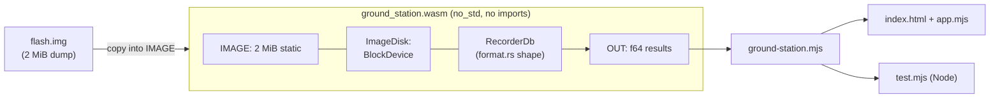

# Ground station

A web page that reads the [flight recorder](../flight_recorder)'s flash
dump with the same horton that wrote it, compiled to WebAssembly.

## Why this runs in a browser

horton's on-disk format changes between versions, and old images are
rejected rather than misread. So the only reader that is sure to
understand a device's flash is the horton that wrote it. A second reader
in another language would be a second format implementation to keep in
sync.

This example compiles the recorder's own horton, with the recorder's own
[`format.rs`](../flight_recorder/format.rs) (its `db_types!` shape,
partition layout and key schema), into a 125 KB module (46 KB gzipped).
Whoever holds a dump pulled off a unit (field support, a test bench, a
customer) opens the page, drops the file on it and sees:

- **Recovery, as the device would do it.** Opening the dump runs horton's
  real `open()`: newest manifest copy, table slots, WAL replay up to a torn
  tail. The page reports how many writes were only in the log when power
  went.
- **An integrity report.** Every value the recorder writes is a hash of
  its key, so the page checks every entry without a copy of the data. It
  also checks that every four-sensor frame landed whole (each is one
  `WriteBatch`) and runs `Db::check_invariants`.
- **The sensors.** One small chart per sensor, sharing a crosshair, over a
  window you move across the flash. Purged glitch windows (range deletes)
  show as gaps, and alarms show as markers. Debug traces are shown live or
  expired against the recorder's clock (TTL).
- **Point reads, the flash layout, and a table view.**

Nothing is uploaded. The dump is copied into the module's memory, so
recovery's writes never reach the file.

## Run it

```sh
rustup target add wasm32-unknown-unknown
cargo run --release --example flight_recorder -- --fresh --fast --ticks 12000   # make a recording
examples/ground_station/build.sh                  # build the module into web/, copy the recording
python3 -m http.server -d examples/ground_station/web 8000
```

Open <http://localhost:8000> and press **Open the latest recording**, or
drop any `flash.img` on the page. For a dump taken mid-write, kill the
recorder while it records (`kill -9`, or Ctrl-C) and open its image.

## How it is built



- **[`src/lib.rs`](src/lib.rs)**: a `no_std` `cdylib`. The image, the
  `Db` and the result buffer are `static`s, so memory is fixed at compile
  time, just as on the device. Its `BlockDevice` is the dump itself, and
  every call completes at once, so a no-op waker drives horton's futures.
  It exports plain `extern "C"` functions (`gs_open`, `gs_summary`,
  `gs_frames`, `gs_reading`, `gs_verify`) and imports nothing: no
  `wasm-bindgen`, no JavaScript glue, and JavaScript cannot re-enter it.
- **[`web/ground-station.mjs`](web/ground-station.mjs)**: a thin wrapper
  that the page and the tests share.
- **[`web/app.mjs`](web/app.mjs)**: the page. There is no framework and
  no build step.

## Tests

```sh
node examples/ground_station/test.mjs target/flight_recorder/flash.img --newest 11999
node examples/ground_station/browser-test.mjs     # needs playwright
```

`test.mjs` opens a real recording through the wrapper and checks it
independently of the wasm: the recorder's value hash is reimplemented in
JavaScript (`BigInt`), and every reading in a 2,000-tick window is checked
against it. It also checks that frames are whole, that point reads agree
with scans, that liveness follows the TTL, and that bad dumps fail cleanly
(wrong size, noise that is `CorruptManifest`, an erased chip that opens
empty). CI runs it on a clean recording and on one killed three times with
SIGKILL mid-write.

`browser-test.mjs` drives the page in headless Chromium in light and dark
themes and at phone width, and fails on any console error.

## One thing the page found

The oldest frame on flash can hold only some of its four readings. That is
not a torn write: the recorder archives whole tables, and a table can end
partway through a frame, so the frame's first readings left with the table
and the rest stayed on flash. `gs_verify` reports that frame separately.
It still fails any partial frame that is not the oldest.

## Next: live telemetry

This page only reads. The write-heavy version of the same idea is a
laptop in the field logging the device's live stream. horton runs in a
Web Worker over OPFS (the browser's private file system, whose sync
access handle maps directly onto `BlockDevice`). Cold tables go to
IndexedDB through the archive API: `archive_plan`, store the blocks and
await the transaction, then `archive_commit`. IndexedDB's `await` falls
between horton calls, never inside one.
