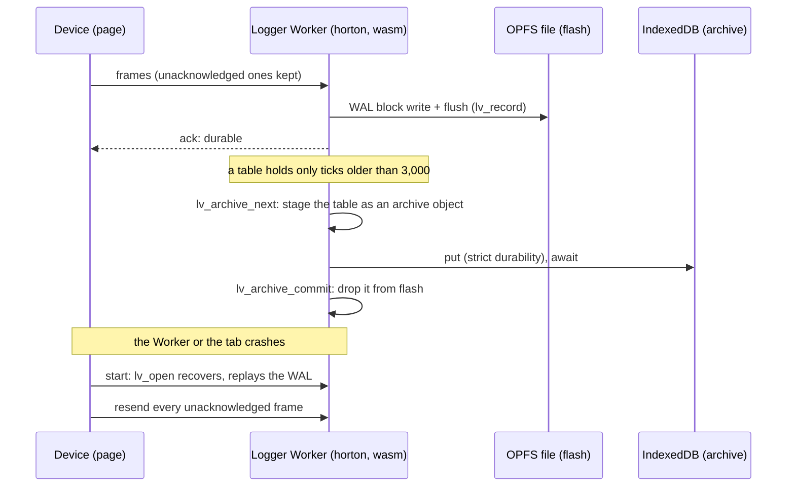

# Ground station

The [flight recorder](../flight_recorder)'s horton, compiled to
WebAssembly, in two web pages:

- **[Open a dump](#open-a-dump):** read a recorder's flash with the same
  horton that wrote it.
- **[Live telemetry](#live-telemetry):** log a recorder's live stream in
  the browser, durably, with cold tables archived to IndexedDB.

Both use the recorder's own
[`format.rs`](../flight_recorder/format.rs) (its `db_types!` shape,
partition layout, key schema and archive object), so the three cannot
drift apart: the live logger's flash opens in the dump viewer, and the
native recorder's `restore` reads the live logger's archive.

## Why this runs in a browser

horton's on-disk format changes between versions, and old images are
rejected rather than misread. So the only reader that is sure to
understand a device's flash is the horton that wrote it. A second reader
in another language would be a second format implementation to keep in
sync.

## Run it

```sh
rustup target add wasm32-unknown-unknown
cargo run --release --example flight_recorder -- --fresh --fast --ticks 12000   # make a recording
examples/ground_station/build.sh                  # build both modules into web/, copy the recording
python3 -m http.server -d examples/ground_station/web 8000
```

Open <http://localhost:8000> for the dump viewer, and
<http://localhost:8000/live.html> for live telemetry. Live telemetry needs
a secure context (`localhost` counts) for the Origin Private File System.

## Open a dump

Whoever holds a dump pulled off a unit (field support, a test bench, a
customer) opens the page, drops the file on it and sees:

- **Recovery, as the device would do it.** Opening the dump runs horton's
  real `open()`: newest manifest copy, table slots, WAL replay up to a torn
  tail. The page reports how many writes were only in the log when power
  went.
- **An integrity report.** Every value the recorder writes is a hash of
  its key, so the page checks every entry without a copy of the data. It
  also checks that every four-sensor frame landed whole (each is one
  `WriteBatch`) and runs `Db::check_invariants`.
- **The sensors.** One small chart per sensor, sharing a crosshair, over a
  window you move across the flash. Purged glitch windows (range deletes)
  show as gaps, and alarms show as markers. Debug traces are shown live or
  expired against the recorder's clock (TTL).
- **Point reads, the flash layout, and a table view.**

Nothing is uploaded. The dump is copied into the module's memory, so
recovery's writes never reach the file.

A frame can be partial on flash without being torn: archiving moves whole
tables, a table boundary can fall inside a frame, and either side can go
to the archive first. So a frame holding a prefix or a suffix of its
sensors is reported as split with the archive; anything else partial is
torn. Proving a split frame is whole needs the archive too, which the live
logger does.

## Live telemetry

A laptop in the field takes the device's telemetry and keeps it the way
the device does. The page simulates the device; the logger is real.



- **Flash is an OPFS file.** The module's `BlockDevice` is three host
  imports (`lv_read`, `lv_write`, `lv_flush`). In the Worker they are an
  OPFS `FileSystemSyncAccessHandle`, whose read, write and flush are
  synchronous, so every horton call completes in one poll, as on the
  device.
- **A frame is acknowledged only once durable.** Each is one
  `WriteBatch`: one WAL block, written and flushed before the ack.
- **Cold tables go to IndexedDB in two steps**, around the only
  asynchronous wait: `lv_archive_next` stages the table as a recorder
  archive object (a header block, then its blocks as they sat on flash);
  the Worker stores it in a `strict` IndexedDB transaction and awaits it;
  then `lv_archive_commit` drops it from flash in one manifest commit. A
  crash in between leaves the table on flash and a copy in IndexedDB; the
  next pass stores it again (the same bytes: table ids never repeat) and
  commits.
- **At-least-once delivery.** The device keeps every frame the logger has
  not acknowledged and resends it after a restart. Recording a frame twice
  writes the same keys and values, so a resend is harmless.
- **Proof on demand.** *Verify the whole history* marks which parts of
  every tick's frame the flash and each archived table hold (each table
  read back through horton's `ingest_table`) and checks every tick from
  the first to the newest is whole somewhere.

Code: [`live/src/lib.rs`](live/src/lib.rs) (the module),
[`web/live-logger.mjs`](web/live-logger.mjs) (its JavaScript half, shared
by the Worker and the Node test),
[`web/logger-worker.mjs`](web/logger-worker.mjs) (OPFS and IndexedDB),
[`web/live.mjs`](web/live.mjs) (the device and the page).

## What the live logger found in horton

Two bugs, both fixed with regression tests in
[`tests/review_findings.rs`](../../tests/review_findings.rs):

- **F20: scans panicked.** The manifest caps level 0 at `TABLES` tables,
  but deeper levels share the whole `LEVELS × TABLES` pool, and region
  pressure fills them. `Scan` and `RevScan` kept `TABLES` cursors per
  level, so a scan over a level holding five tables indexed past its row.
  The flight recorder never hit it because it archives every 250 ticks;
  the logger, archiving only when asked, did within 8,000 ticks.
- **F21: a torn batch recovered in part.** On NOR flash a torn write
  leaves erased bytes after the tear. On a file (OPFS, an SD card, a
  disk) it leaves the block's previous bytes, and when the previous write
  was a batch of the same shape, its closing record sits exactly where the
  new one's should, with a valid CRC. It closed the torn group, and a frame
  came back with three sensors. Recovery now ends a block at the first
  record no newer than the one before it.

It also found that the recorder's `restore` could not read an archive of
more than a few dozen tables (one database of the recorder's shape has 16
table slots); it reads each table through its own database now.

## Tests

```sh
node examples/ground_station/test.mjs target/flight_recorder/flash.img --newest 11999
node examples/ground_station/live-test.mjs 300 --export target/live-export
cargo run --release --example flight_recorder -- restore --dir target/live-export
(cd examples/ground_station && node browser-test.mjs && node live-browser-test.mjs)   # need playwright
```

- **`test.mjs`** opens a real recording through the viewer's wrapper and
  checks it independently of the wasm: the recorder's value hash is
  reimplemented in JavaScript (`BigInt`), and every reading in a
  2,000-tick window is checked against it, along with frame atomicity,
  point reads, TTL liveness, and bad dumps failing cleanly. CI runs it on a
  clean recording and on one killed three times with SIGKILL.
- **`live-test.mjs`** runs the live logger (the Worker's own code) over
  memory that loses power partway through a write, keeping the old bytes
  after the tear, and an archive that loses power just before or just
  after storing a table. After each of 300 cuts it boots a fresh module and
  proves every durable tick is whole across flash and archive and that
  nothing acknowledged is missing. Then the dump viewer opens its flash,
  and `--export` writes the archive for the native recorder's `restore`.
- **`browser-test.mjs`** drives the dump viewer in headless Chromium in
  light and dark themes and at phone width, and fails on any console
  error.
- **`live-browser-test.mjs`** streams to the live logger in Chromium with
  real OPFS and IndexedDB until tables are archived, kills the Worker
  mid-stream, then crashes the whole tab (`chrome://crash`), opens a new
  tab and proves every acknowledged frame survived and the history is
  whole; the downloaded `flash.img` then opens in the dump viewer.

## How it is built

- **[`src/lib.rs`](src/lib.rs)**: the dump viewer, a `no_std` `cdylib`
  with no imports (125 KB, 46 KB gzipped). The image, the `Db` and the
  result buffer are `static`s, so memory is fixed at compile time, as on
  the device. Its `BlockDevice` is the dump itself.
- **[`live/src/lib.rs`](live/src/lib.rs)**: the live logger, a `no_std`
  `cdylib` whose `BlockDevice` is three host imports (340 KB, 90 KB
  gzipped: it carries the write path, compaction, and a second database
  to read archived tables back through).
- **[`src/common.rs`](src/common.rs)**: the reads both modules share
  (summary, frame windows, point reads, verification, coverage), generic
  over the block device.
- Both export plain `extern "C"` functions: no `wasm-bindgen`, no
  JavaScript glue. A panic (a bug) leaves its location in the error buffer
  before trapping, and the wrappers report it.
- **[`web/`](web)**: the pages, with no framework and no build step.
  [`sensor-charts.mjs`](web/sensor-charts.mjs) and
  [`station.css`](web/station.css) are shared by both.
